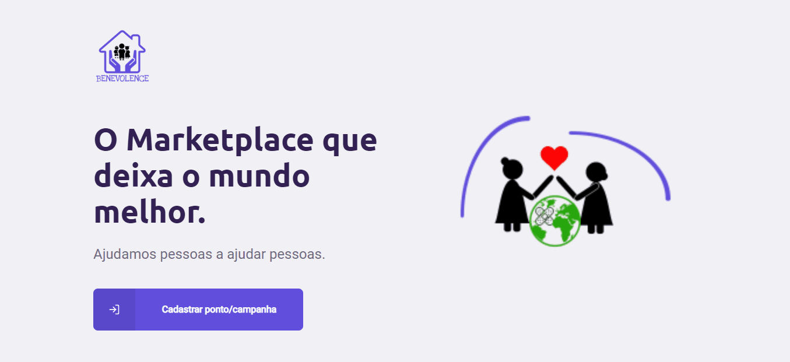

    
    <h1 align="center">
        Benevolence
    </h1>
    
O Marketplace que deixa o mundo melhor. Ajudamos pessoas a ajudar pessoas.

  <a href="#tecnologias">Tecnologias</a>&nbsp;&nbsp;&nbsp;|&nbsp;&nbsp;&nbsp;
  <a href="#projeto">Projeto</a>&nbsp;&nbsp;&nbsp;|&nbsp;&nbsp;&nbsp;
  <a href="#layout">Layout</a>&nbsp;&nbsp;&nbsp;|&nbsp;&nbsp;&nbsp;

## Layout

    

## 🚀 Tecnologias

Esse projeto foi desenvolvido com as seguintes tecnologias:
- [React](https://reactjs.org)
- [NodeJS](https://nodejs.org/en/)
- [Styled-components](https://styled-components.com/)

## 💻 Projeto

O Benevolence é um marketplace que ajuda pessoas a ajudar outras pessoas.

